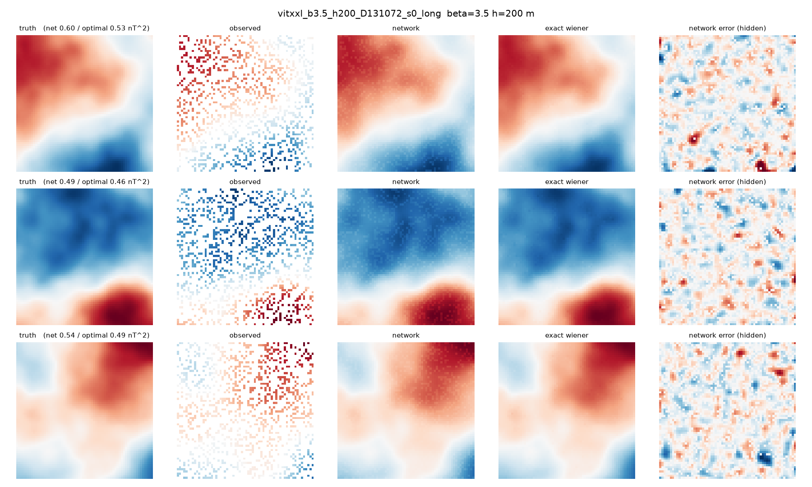
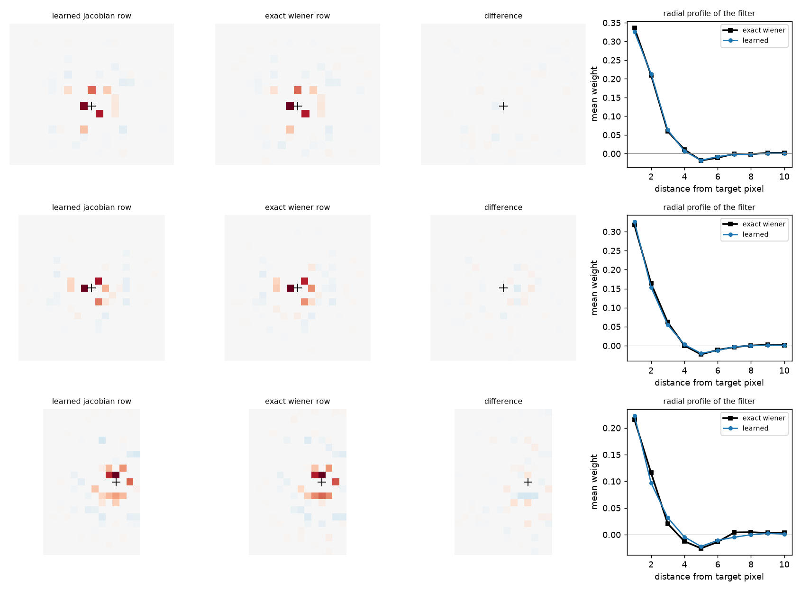
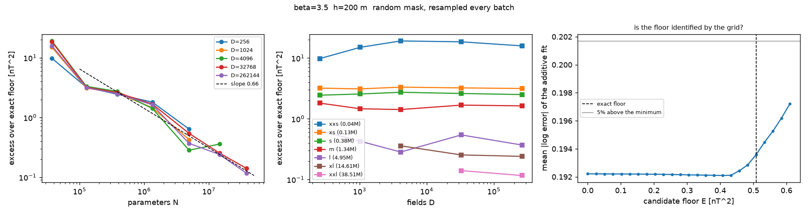
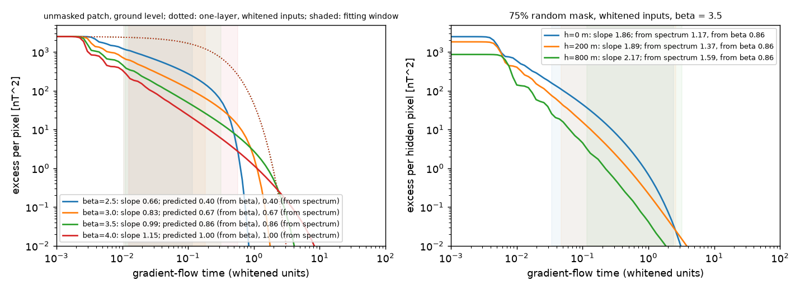
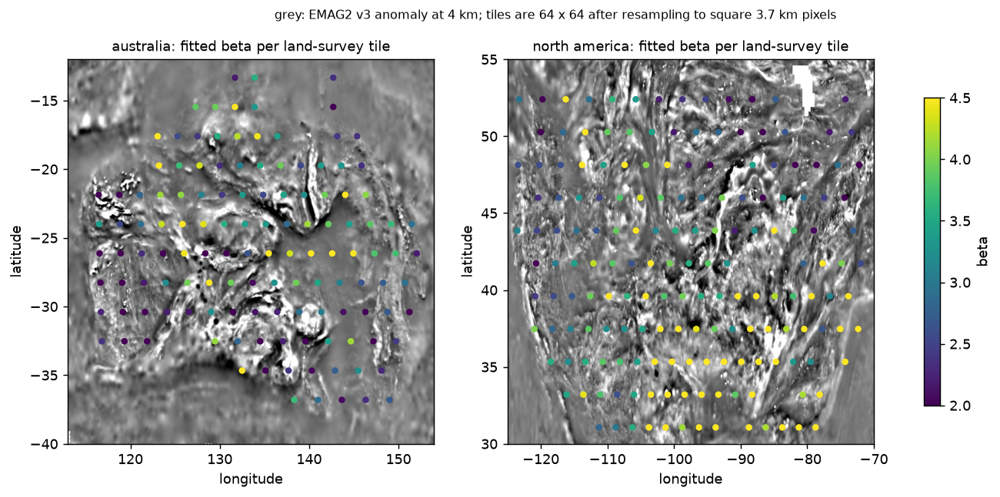
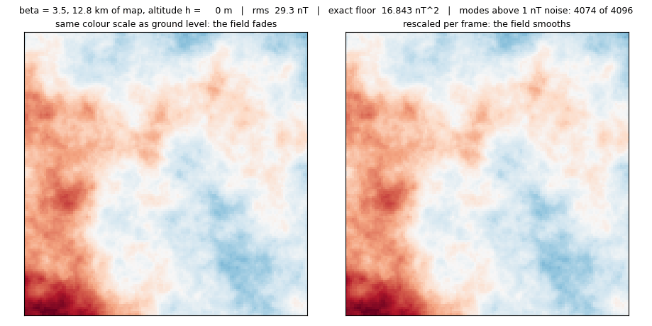
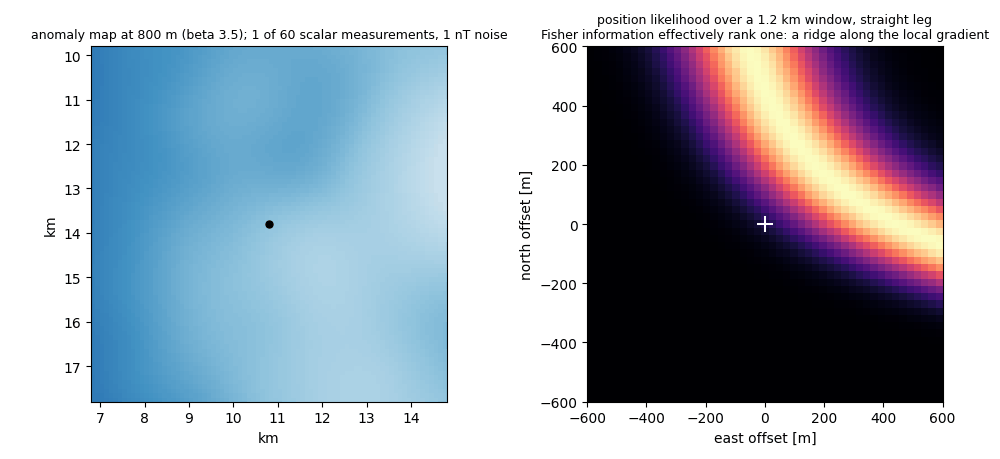
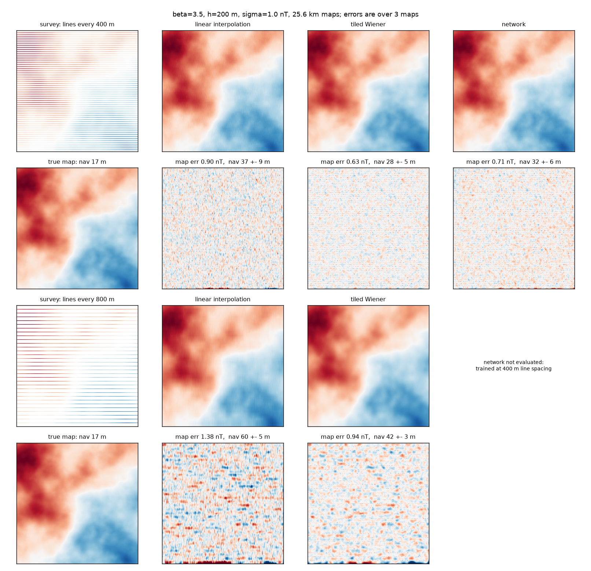

# Magnetic Navigation

Transformers trained to fill in missing pixels of magnetic anomaly maps, measured against
the exact best possible reconstruction for the same data. Assessment for Dirac Labs,
September 2026.

The maps are Gaussian random fields, so the best possible reconstruction of the hidden
pixels is known in closed form and so is its error. That number is the zero of every axis
in this repository. Problem 1 (the physics of a magnetic fix) is in
`problem1/`; Problems 2 and 3 are the experiment described below.



*Three 6.4 km patches at 200 m with 75% of pixels hidden, reconstructed by the 38.5M
transformer, next to the exact estimator for the same mask.*

## The result

At beta 3.5, 200 m altitude, 1 nT noise and 75% masking, the exact floor is 0.508 nT^2.
The 38.5M transformer reaches 0.553 after 24k steps, 9% above the floor. At the 8k-step
budget of the scaling grid the same model was at 1.10.

## The Findings

1. The network learns the exact estimator. At a fixed mask it is linear in its input to
   0.5%, and its Jacobian rows are within 16% of the exact Wiener rows.
2. The remaining gap is optimisation. Trained against the exact conditional mean, the
   same model's approximation error is at most 0.031 nT^2, 6% of the floor; estimation
   error is about 0.006.
3. More than half of the apparent parameter scaling is the training budget growing with
   model size: slope 0.66 across the grid at 200 m, 0.25 read at equal steps, and no
   positive size dependence above 5M parameters.
4. A fit free to choose its own floor puts it at zero in every condition. The analytic
   floor has to be supplied; the grid cannot recover it.
5. The theory can be tested, and part of it fails. The two-layer linear network's time
   exponent, the one statement in Problem 3 with a proof, matches its closed-form test to
   within the log factor the derivation drops; the conjecture that it survives the mask is
   false as written.
6. On EMAG2 tiles the network does not transfer. It is worse than interpolation by
   the median and about 4x worse than the exact estimator carrying the network's own
   training prior; real tiles sit 2 to 10x above any Gaussian floor.

Map error becomes position error: on maps reconstructed from synthetic survey lines the
navigator is at 28 m (exact estimator), 32 m (network) and 37 m (interpolation), against
17 m on the true map.

## In pictures



*Finding 1. Rows of the trained network's input-output Jacobian against the exact Wiener
filter for the same mask, three target pixels, 24k steps. The 8k-step comparison is
figures/jacobian_*_ref_*.png.*



*Findings 3 and 4. Excess over the floor against parameters (a step between 1.3M and 5M),
against dataset size (no consistent dependence above about a thousand fields), and the fit
error against candidate floor (the fit prefers a floor near zero).*



*Finding 5. Closed-form gradient flow of the two-layer linear network. Left: ground level,
four values of beta, with the fitting window shaded and the one-layer model dotted. Right: with
a 75% mask; the whitened spectrum steepens and so does the exponent.*



*Finding 6. Fitted spectral slope beta per land-survey tile over EMAG2's 4 km grid. The study
assumes 2.5 to 4; the tiles do not stay inside it, and the slope varies by geological province.*



*Problem 1C and Part A. One field continued upward from 0 to 1000 m
(`python -m magscale.animate upward`). The floor and the number of modes above the noise, in
the title, are what altitude does to the reconstruction problem: 16.8 to 0.06 nT^2, 4074 to 55
modes.*



*Problem 1C. A scalar magnetometer flown over the 800 m map with one turn
(`python -m magscale.animate navigate`). The position likelihood is a ridge along the local
gradient after one measurement, the rank-one Fisher information, and rounds once the
trajectory turns.*



*Map error becomes position error: survey lines every 400 m and 800 m, reconstructed by
interpolation, the network and the tiled exact estimator, each used as the navigation map
against the true field.*

## Reproduce

CPU version:

```
pip install -r requirements.txt
make test        # 10 checks: covariance, masks, floor, Wiener matrix, fitter, Tolles-Lawson rank
make demo        # one map, 75% hidden, interpolation against the exact estimator
make figures     # every checkpoint-independent figure and table, from the committed run files
```

All 191 training runs are committed as json, so the fits and figures rebuild without a
GPU. `make figures` rewrites the generated figures and tables; the broken-power-law
columns depend on the optimiser and can differ in the last digit.

Full sweep commands, checkpoint downloads and the EMAG2 data step are in
[`docs/reproduce.md`](docs/reproduce.md).

## Where the detail is

| | |
|---|---|
| Problem 1, derivations and numerical checks | [`problem1/`](problem1/) |
| Problem 2, floor, scaling grid, gap, engineering, real data | [`docs/problem2.md`](docs/problem2.md) |
| Problem 3, theory, probes, predictions against measurements | [`docs/problem3.md`](docs/problem3.md) |
| Every number quoted above, generated from the run files | [`docs/results_tables.md`](docs/results_tables.md) |
| What went wrong along the way, and what replaced it | [`docs/failures.md`](docs/failures.md) |

## Limitations

Most configurations were trained once; where seeds exist the scatter is about 30% of the
excess, so differences smaller than that are not resolved, and the error bars are a
bootstrap that uses that scatter as a proxy rather than replicated runs.
The scaling slopes are protocol slopes: the budget grows with model size and most large
runs were still improving at their last step. The parametrisation called muP-inspired is
not validated as muP. Real aeromagnetic data is not a stationary Gaussian field, which is
what the EMAG2 test measures. The full list is in
[`docs/problem2.md`](docs/problem2.md).

## Layout

| folder | content |
|---|---|
| `magscale/` | data generation, exact floor, models, training, fits, probes, navigation, EMAG2 |
| `problem1/` | Problem 1 derivations, numerical checks, edge cases |
| `docs/` | write-ups, generated results tables, reproduction notes, the checkpoint release manifest |
| `runs/` | one json per training run: config, seed, hardware, loss history |
| `results/`, `figures/` | fits, probes, and every figure |
| `scripts/` | run-list generator, runners, cluster scripts, and the exact command for every run (`scripts/sweeps/`) |
| `presentation/` | the presentation, as PDF |
| `tests/` | correctness checks, run by CI on every push |
